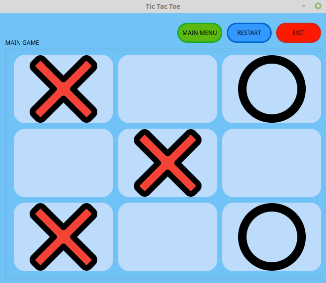
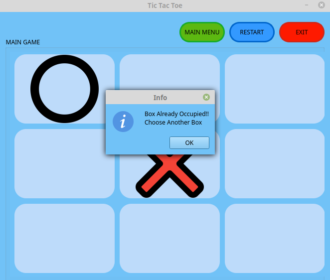

# TIC_TAC_TOE
My take on classical TIC-TAC-TOE game with a Graphical approach using C++ and QT Framework.

## INTRODUCTION
TIC-TAC-TOE is a game everybody have been playing for a very long time. I was always fascinated on making my own applications when I started learning to code.
This is my take on the classical game we all loved using Qt framework and C++

## CONTENTS
I'll try to take you through most of the things explaining the basics of the Game.
- Designing the layout for Menu and Game Screen
- Adding stylesheets to beautify the application
- Implementing Button functionalities
- Game Collision mechanism to detect filled gaps
- Implementing the Winning function to decide the Winner

### Design and Layout
The very first thing we need is a clear picture of what we want to build.
#### MAIN MENU LAYOUT
your main menu for the game can vary, but i decided to keep it simple.

#### well keeping it simple. Here are some key points :
- The Menu is pretty much self explanatory. We have a PLAY BUTTON ,Exit Button and I decided to add an About to make it look filling.
- The Tic-Tac-Toe main image is on a label using Pixmap from the icon pack in Application resources.
- In order to arrange everything is specific layout we use the GRID Layoout to keep everything together.

#### GAME SCREEN LAYOUT
we all are familiar with the Game screen that we need. in order to achieve we add QPushButton in a GRID layout and fix the size from properties.

- I have added some button again to make the screen look filling and rich.
- I kept the window size as fixed because I don't want to make the padding change abruptly.
- I have added  Exit, Reset and Main Menu Buttons.
We added our buttons it won't look the same without StyleSheet.

### StyleSheet
Let's Just beautify our buttons. Qt works with StyleSheets which are very very similar to CSS.
Now I am not a Web Devloper or a Designer but we do have online CSS generators which are really helpful and time saving.


Our Online CSS Generator Works beautifully (LOL) but jokes apart it looks stunning.
I did the same with the menu background and changed the Exit button color to red.

### Attaching SIGNALS and SLOTS
Signals and Slots are used inorder to give functionality to our button. It's similar to assigning  a function that's being called everytime we click the button.
- The about button have the most simple implementation of them all.
  I want it to show an about window Which can be done using the QMEssageBox class. This is what the about button   implementation looks like.
```
void MainWindow::on_pushButton_2_clicked()
{
    QMessageBox::aboutQt(this,"About");
}

//We can make our custom about but it's Good using the already installed Qt about as it is more visually correct
//Also let's assign a function to Exit Button
// i want my exit to pop up a confirmation window which can be done by the qustion method of QMessageBox class

void MainWindow::on_exit_clicked()
{
    QMessageBox::StandardButton reply = QMessageBox::question(this,"Confirmation","Are You Sure You Want to Quit ?",QMessageBox::Yes |QMessageBox::No );
   //if user clicks on yes we quit
   if(reply==QMessageBox::Yes)
     {
         QApplication::quit();
     }

}


```
##### We added functions for two of our buttons and here's what the result looks like


But our Play function is yet to be assigned.
what i have in mind is every time we hit play it opens up the GAME LAYOUT file that we made earlier.
- for that we make a Game class object in mainwindow.h and call our object as a widget.
after making the class object aall we need to add to the function is this 
```
void MainWindow::on_play_clicked()
{
    game=new Game(this);
    this->close();
    game->show();
}
//pretty much self explanatory
```
so now every time we hit play button it opens up our Game layout page.

we do the same method for the exit  button on our game layout too.
But for our reset and Main Menu Button we add Funtion that's
```
void Game::on_restart_clicked()
{
    for(int r=0;r<3;r++)
    {
        for(int c=0;c<3;c++)
            boxcheck[r][c]=0;
    }
    count=0;
    QWidget *parent= this->parentWidget();
    this->close();
    parent->show();
}
// what the function is doing is it's reseting the boxcheck matrix value back to zero which we will use in collision detection for boxes and openeing the main screen as a new widget. now since game screen inherits main screen we call the parent class directly.Also closing the game screen.


```
### GAME COLLISION
Well in tic-tac-toe you don't check an already checked box if that's not obviuous enough.
But as I learned from experience you gotta make everything idiot proof.
##### Boxcheck and deciding when to put X and O
I kept things simple let's say X always go first and O after X.
i declared a simple count variable to 0 and if it's zero we change icon of button to x and once clicked we change count value to 1 and if it's 1 we change button icon to O.
also we need to mark every box we visit or click. so we simply make a 3x3 matrix also if we add button icon to X we mark matrix val 5 why 5 ?? you can have any value you like 5 just poped up out of nowhere for me and for ) let's go with 10.
so our logic is something like this in Pseudo code
```
int count=0;
int boxcheck[3][3];
when clicked()
{
if(count==0 && boxcheck[i][j]==0)
  set icon 'X'
  set count 1
else if (count == 1 && boxcheck[i][j]==0)
  set icon 'O'
  set count 0
else if(boxcheck[i][j]!=0)
  PoP Messsage "Invalid Move Box Already Occupiped"
}
```
now let's actually code it up
i linked row and column with button id to make it go easy now we just need to copy and change value for every individual button and we are good to go.
```
int h=ui->pushButton_11->height();
    int w=ui->pushButton_11->width();
    if(boxcheck[1][1]==0){
    if(count==0 && boxcheck[1][1]==0)
    {
    ui->pushButton_11->setIcon(QIcon(":/icon_pack/icon/close.png"));
    count=1;
    boxcheck[1][1]=5;
    }
    else if(count==1 && boxcheck[1][1]==0)
    {
        ui->pushButton_11->setIcon(QIcon(":/icon_pack/icon/dot.png"));
        count=0;
        boxcheck[1][1]=10;
    }
   }
    else if(boxcheck[1][1]!=0)
    {
       QMessageBox::information(this,"Info","Box Already Occupied!!\nChoose Another Box");
    }
    ui->pushButton_11->setIconSize(QSize(w-2,h-2));
   //winner condition 
   findwinner(boxcheck);
```
After adding functions to our button and collision detection this is what we have.


now all we need is to decide who wins!!!

### Deciding the Winner
well we all are familiar with the rules in tic tac toe
we have four conditions to satisfy
- Row Win
- Column Win
- Primary Diagonal Win
- Secondary Diagonal Win
Also our boxcheck matrix with already registered values will come handy here/
In PseudoCode this is what we need to check
we need a counter to keep count of till 3. if count reach three we declare winner
```
//Row Check
int xcount=0,ocount=0;
for(int r=0;r<3;r++)
{
  for(int c=0;c<3;c++)
    {
    if(boxcheck[r][c]==5
     xount++;
    else if(boxcheck[r][c]==10)
     ocount++;
    }
    if(xcount==3)
      print X wins
       break;
    else if (ocount == 3)
     print O wins
      break;
    else
     reset xcount=ocount=0
}

//the same goes for row count
xcount=ocount=0;
for(int c=0;r<3;r++)
{
  for(int r=0;c<3;c++)
    {
    if(boxcheck[r][c]==5
     xount++;
    else if(boxcheck[r][c]==10)
     ocount++;
    }
    if(xcount==3)
      print X wins
       break;
    else if (ocount == 3)
     print O wins
      break;
    else
     reset xcount=ocount=0
}
// for primary diagonal wee add condition if r==c  and only then check
//and for secondary we simply check if r+c>3
```

so we added the win functionality too. now we just call our function after every button click.
now we are done with our game and this is what we have

####
So this is how i finally made my own version of TIC-TAC-TOE using QT and C++
